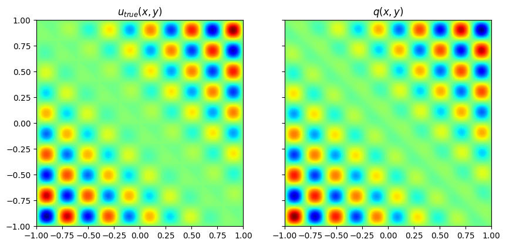

```python
# Install the needed libraries
%pip install --upgrade pip
%pip install --upgrade "jax[cuda]" -f https://storage.googleapis.com/jax-releases/jax_cuda_releases.html optax flax
```


```python
from typing import Callable, Tuple, Optional, Union, List, Any
from dataclasses import dataclass, field
import jax
from jax import random, grad, vmap, jit, value_and_grad
from functools import partial
import jax.numpy as jnp
import numpy as np
import matplotlib.pyplot as plt
import flax
from flax import linen as nn
from flax.training.train_state import TrainState
import optax
import time
import datetime

```

## The problem at hand

We will now solve the 2D Helmholtz equation given by:

$$\Delta u + k^2 u = q(x, y), \mbox{with } (x,y) \in [-1,1]^2 $$

with homogeneous Dirichlet boundary conditions.

When $k$ is wave number, the forcing term is given by:

$$ q(x,y) = 2 \pi k \cos{(\pi k y)} \sin{(\pi k x)} + 2 \pi k \cos{(\pi k x)} \sin{(\pi k y)} + k^2(x + y) \sin{(\pi k x)} \sin{(\pi k y)} - 2 \pi^2 k^2 (x+y) \sin{(\pi k x)} \sin{\pi k y}$$

while the exact solution is given by:

$$ u(x, y) = (x+y) \sin{(c_1 \pi k x)} \sin{(c_2 \pi k y)}$$


The example was taken from https://arxiv.org/abs/1906.01170

## Approximating the system's behavior using a Neural Network

## Codificador Posicional
O codificador posicional transforma as entradas do modelo adicionando funções seno e cosseno de diferentes frequências. Para uma entrada 
$x$, o codificador gera:
$$enc(x) = [x, sin(2^0 \pi x), cos(2^0 \pi x), sin(2^1 \pi x), cos(2^1 \pi x),...,sin(2^L \pi x), cos(2^L \pi x)]$$
$L$ é o número de níveis harmônicos.

Esse processo aumenta a capacidade do modelo de resolver padrões de alta frequência, como os encontrados em equações diferenciais como Helmholtz.


```python
def positional_encoding(inputs, L=10):
    """
    Aplica codificação posicional aos inputs.
    
    Parameters:
        inputs: jnp.ndarray
            Entrada original (e.g., x ou y).
        L: int
            Número de níveis de frequências harmônicas.

    Returns:
        jnp.ndarray:
            Entrada codificada posicionalmente.
    """
    encoded = [inputs]  # Incluímos o valor original
    for i in range(L):
        freq = 2 ** i * jnp.pi
        encoded.append(jnp.sin(freq * inputs))
        encoded.append(jnp.cos(freq * inputs))
    return jnp.concatenate(encoded, axis=-1)  # Concatena tudo

```

### Neural Network


```python
rng_key_d = random.PRNGKey(4)
def _get_activation(activation_name):
    activations = {**jax.nn.__dict__, **jnp.__dict__}
    if activation_name in activations:
        return activations[activation_name]
    else:
        raise NotImplementedError("This activation function is not implemented yet!")

class DenseLayer(nn.Module):
    features: int
    kernel_init: Callable = nn.initializers.lecun_normal()
    bias_init: Callable = nn.initializers.zeros

    @nn.compact
    def __call__(self, x):
        kernel = self.param(
            "kernel",
            self.kernel_init, 
            (x.shape[-1], self.features),
        )

        bias = self.param("bias", self.bias_init, (self.features,))

        return jnp.dot(x, kernel) + bias

class Mlp(nn.Module):
    arch_name: Optional[str] = "Mlp"
    num_layers: int = 4
    layer_size: int = 64
    out_dim: int = 1
    activation: str = "tanh"
    lb: List = field(default_factory=List)
    ub: List = field(default_factory=List)
    harmonic_levels: int = 10 # Número de frequências no codificador posicional
    extra_params: Any = None

    def setup(self):
        self.activation_fn = _get_activation(self.activation)
        self.lb_array = jnp.asarray(self.lb)
        self.ub_array = jnp.asarray(self.ub)

    @nn.compact
    def __call__(self, *inputs):
        # Normalize the inputs
        x = (
            2.0 * (jnp.stack(inputs) - self.lb_array) / (self.ub_array - self.lb_array)
           - 1.0
        )
        # Aplica codificação posicional
        x = positional_encoding(x, L=self.harmonic_levels)

        for _ in range(self.num_layers):
            x = DenseLayer(features=self.layer_size)(x)
            x = self.activation_fn(x)

        # Output layer
        x = DenseLayer(features=self.out_dim)(x)

        return x.flatten()
```

## The batch sampler

This time, let's implement a sampler so we can obtain the PDE residual evaluation points randomly


```python
class Helmholtz2DSampler(object):
    def __init__(self, batch_size, dom_bds, rng_key):
        self.batch_size = batch_size
        self.key = rng_key
        self.dom_bds = dom_bds

    def __getitem__(self, index):
        self.key, subkey = random.split(self.key)
        batch = self.data_generation(subkey)
        return batch

    @partial(jit, static_argnums=(0,))
    def data_generation(self, key):
        key1, key2 = random.split(key)
        # Points for evaluating the PDE residual
        x = random.uniform(
            key1,
            shape=(self.batch_size,),
            minval=self.dom_bds["xmin"],
            maxval=self.dom_bds["xmax"],
        )
        y = random.uniform(
            key2,
            shape=(self.batch_size,),
            minval=self.dom_bds["ymin"],
            maxval=self.dom_bds["ymax"],
        )

        return {
            "x": x,
            "y": y,
            "xmin": self.dom_bds["xmin"],
            "xmax": self.dom_bds["xmax"],
            "ymin": self.dom_bds["ymin"],
            "ymax": self.dom_bds["ymax"],
        }
```

# Agendador de taxa de aprendizado

Agendador de taxa de aprendizado (learning rate schedule) com aquecimento (warmup) e decaimento exponencial (exponential decay):

**Implementação do Scheduler**

Use a função optax.join_schedules para combinar um período de warmup com o decaimento exponencial.

**Explicação**

* __Warmup__ (`linear_schedule`): Aumenta linearmente a taxa de aprendizado de `init_value` para `peak_value` nos primeiros `warmup_steps`.

* __Decaimento Exponencial__ (`exponential_decay`): Após o período de warmup, a taxa de aprendizado decai exponencialmente com a fórmula:

    $learning\ rate = peak\ value \cdot (decay\ rate)^{step/decay\ steps}$
 
* __Combinação__ (`join_schedules`): Une os dois agendadores e aplica o warmup antes do decaimento.


```python
def create_warmup_exponential_decay_schedule(
    init_value=1e-6,
    peak_value=1e-3,
    warmup_steps=1000,
    decay_rate=0.98,
    decay_steps=5000,
):
    """
    Cria um agendador de taxa de aprendizado com warmup seguido por decaimento exponencial.
    """
    # Agendador para a fase de warmup
    warmup_schedule = optax.linear_schedule(
        init_value=init_value,
        end_value=peak_value,
        transition_steps=warmup_steps,
    )

    # Agendador para o decaimento exponencial
    decay_schedule = optax.exponential_decay(
        init_value=peak_value,
        transition_steps=decay_steps,
        decay_rate=decay_rate,
    )

    # Combinar warmup e decaimento exponencial
    schedule = optax.join_schedules(
        schedules=[warmup_schedule, decay_schedule],
        boundaries=[warmup_steps],
    )

    return schedule

```

# Train


```python
# Define the train step function
@jit
def train_step(state, batch, k, u_max):

    def pde_residual_fn(params, x, y):

        u = state.apply_fn(params, x, y)
        u_xx = grad(grad(state.apply_fn, 1), 1)(params, x, y)
        u_yy = grad(grad(state.apply_fn, 2), 2)(params, x, y)

        q = (
            2.0 * jnp.pi * k * jnp.cos(jnp.pi * k * y) * jnp.sin(jnp.pi * k * x)
            + 2.0 * jnp.pi * k * jnp.cos(jnp.pi * k * x) * jnp.sin(jnp.pi * k * y)
            + k**2 * (x + y) * jnp.sin(jnp.pi * k * x) * jnp.sin(jnp.pi * k * y)
            - 2.0 * jnp.pi**2 * k**2 *(x + y) * jnp.sin(jnp.pi * k * x) * jnp.sin(jnp.pi * k * y)
        )/u_max
        res = (u_xx + u_yy) + k**2 * u - q 
        return res

    # Define the loss function
    def loss_fn(params, batch):

        res_pred = vmap(pde_residual_fn, (None, 0, 0))(params, batch["x"], batch["y"])
        pde_loss = jnp.square(res_pred).mean()

        u_west = vmap(state.apply_fn, (None, None, 0))(
            params, batch["xmin"], batch["y"]
        )

        u_east = vmap(state.apply_fn, (None, None, 0))(
            params, batch["xmax"], batch["y"]
        )

        u_north = vmap(state.apply_fn, (None, 0, None))(
            params, batch["x"], batch["ymax"]
        )

        u_south = vmap(state.apply_fn, (None, 0, None))(
            params, batch["x"], batch["ymin"]
        )

        data_loss = (
            jnp.square(u_west).mean()
            + jnp.square(u_east).mean()
            + jnp.square(u_north).mean()
            + jnp.square(u_south).mean()
        )

        total_loss = 20.0 * data_loss + pde_loss

        return total_loss, {
            "total_loss": total_loss,
            "data_loss": data_loss,
            "pde_loss": pde_loss,
        }

    # Compute the loss and its grads w.r.t. the model parameters
    (_, loss_components), grads = value_and_grad(loss_fn, has_aux=True)(
        state.params, batch
    )
    state = state.apply_gradients(grads=grads)
    return loss_components, state


@jit
def eval_step(state, batch, x, y):
    def l2_error(params, batch):
        u_pred = vmap(vmap(state.apply_fn, (None, None, 0)), (None, 0, None))(
            params, x, y
        )
        return jnp.linalg.norm(x=(u_pred.flatten() - batch["u"].flatten()), ord=2) / jnp.linalg.norm(
            x=batch["u"].flatten(), ord=2
        )

    return l2_error(state.params, batch)
```


```python
def helmholtz_2d(k = 1, n = 101, xb = [-1, 1], yb=[-1, 1]):
    u_true_fn = lambda x, y: (x + y) * jnp.sin(jnp.pi * k * x) * jnp.sin(jnp.pi * k * y)

    du_dx_0_fn = lambda y: jnp.pi * k * y * jnp.sin(jnp.pi * k * y)
    du_dy_0_fn = lambda x: jnp.pi * k * x * jnp.sin(jnp.pi * k * x)

    q_fn = (
        lambda x, y: 2.0 * jnp.pi *k * jnp.cos(jnp.pi * k * y) * jnp.sin(jnp.pi * k * x)
        + 2.0 * jnp.pi * k * jnp.cos(jnp.pi * k * x) * jnp.sin(jnp.pi * k * y)
        + k**2 * (x + y) * jnp.sin(jnp.pi * k * x) * jnp.sin(jnp.pi * k * y)
        - 2.0 * jnp.pi**2 * k**2 * (x + y) * jnp.sin(jnp.pi * k * x) * jnp.sin(jnp.pi * k * y)
    )

    x = jnp.linspace(xb[0], xb[1], n)
    y = jnp.linspace(yb[0], yb[1], n)

    u_true = vmap(vmap(u_true_fn, (None, 0)), (0, None))(x, y)
    q = vmap(vmap(q_fn, (None, 0)), (0, None))(x, y)
    u_max = jnp.max(u_true)
    q_max = jnp.max(q)
    return {
        "x": x,
        "y": y,
        "u_true": u_true,
        "u_true_norm": u_true / u_max,
        "u_max": u_max,
        "forcing_term": q,
    }

```

# Graphics


```python
def helmholtz_graf(x, y, u_true, u_pred, k, ep, timelapse):
    fig, axs = plt.subplots(1, 3, figsize=(10, 10 / 1.618))
    
    im = axs[0].contourf(x, y, u_true, levels=128, cmap="jet")
    fig.colorbar(im, ax=axs[0], location='bottom', ticks=np.linspace(u_true.min(), u_true.max(), 5))
    axs[0].set_title(r"$u_{true}(x,y)$")
    
    im = axs[1].contourf(x, y, u_pred, levels=128, cmap="jet")
    fig.colorbar(im, ax=axs[1], location='bottom', ticks=np.linspace(u_pred.min(), u_pred.max(), 5))
    axs[1].set_title(r"$u_{pred}(x,y)$")
    
    error = jnp.abs(u_pred-u_true)
    im = axs[2].contourf(x, y, error, levels=128, cmap="jet")
    fig.colorbar(im, ax=axs[2], location='bottom', ticks=np.linspace(error.min(), error.max(), 5))
    axs[2].set_title(r"$|err(x,y)|$")
    
    for ax in axs:
        ax.set_aspect("equal")
    
    fig.tight_layout()
    fig.suptitle("Prediction AFTER training the model")
    plt.savefig(f'results/helmholtz_k{k}EPL{ep}.jax.png')

    a = sum(error)/len(error)
    b = sum(a)/len(a)

    formatted_time = str(datetime.timedelta(seconds=int(timelapse)))
    
    print(f"time:{formatted_time} error: {b}")
    with open(f"results/helmholtz_k{k}EPL{ep}.log","w") as file:
        file.write(f"time:{formatted_time} error: {b}")
```


```python
def helmholtz_error_graf(total_loss_log, data_loss_log, pde_loss_log, error_log, k, ep):
    fig, ax = plt.subplots(1, 1, figsize=(10, 10 / 1.618))
    epoch_log = jnp.linspace(0, ep, len(total_loss_log))
    ax.plot(epoch_log, total_loss_log, label="Total Loss")
    ax.plot(epoch_log, data_loss_log, label="Data Loss")
    ax.plot(epoch_log, pde_loss_log, label="PDE Loss")
    ax.plot(epoch_log, error_log, label="Error")
    
    ax.set_yscale("log")
    ax.legend()
    plt.savefig(f'results/helmholtz_error_k{k}EPL{ep}.jax.png')
```


```python

def helmholtz_init_graf(x,y,u_true,q):
    fig, axs = plt.subplots(1, 2, figsize=(10, 10 / 1.618), sharex=True, sharey=True)
    
    axs[0].contourf(x, y, u_true, levels=128, cmap="jet")
    axs[0].set_title(r"$u_{true}(x,y)$")
    axs[1].contourf(x, y, q, levels=128, cmap="jet")
    axs[1].set_title(r"$q(x,y)$")
    
    for ax in axs:
        ax.set_aspect("equal")
```

# Main


```python
def multigrid_training(state, rng_key, k, resolutions, n_ep = 5000, xdom=[-1,1], ydom=[-1,1]):
    total_loss_log = []
    data_loss_log = []
    pde_loss_log = []
    epoch_log = []
    error_log = []
    
    #####################################################################
    batch_acc = len(resolutions) - 1 if len(resolutions) > 1 else 1
    rng_key, subkey = random.split(rng_key)
    start = time.time()
    # Loop over resolutions
    for resolution in resolutions:
        print(f"Training at resolution: {resolution}x{resolution}")

        # Generate data for this resolution
        hmt = helmholtz_2d(k, resolution)
        x, y, u_true_n, u_max = hmt["x"], hmt["y"], hmt["u_true_norm"], hmt["u_max"]

        sampler = Helmholtz2DSampler(
            batch_size=int(256 + resolution/(batch_acc)) ,
            dom_bds={"xmin": xdom[0], "xmax": xdom[1], "ymin": ydom[0], "ymax": ydom[1]},
            rng_key=subkey,
        )
        batch_iterator = iter(sampler)

        eval_batch = {"x": x, "y": y, "u": u_true_n}
        for epoch in range(n_ep):
            train_batch = next(batch_iterator)
            loss, state = train_step(state, train_batch,k, u_max)
            if epoch % 200 == 0:
                l2_error = eval_step(state, eval_batch, x, y)
        
                epoch_log.append(epoch)
                total_loss_log.append(loss["total_loss"])
                data_loss_log.append(loss["data_loss"])
                pde_loss_log.append(loss["pde_loss"])
                error_log.append(l2_error)
                # l2_error = 0
                print(
                    f"Epoch: {epoch} -- Total Loss: {loss['total_loss']}  -- Data Loss: {loss['data_loss']} -- PDE Loss: {loss['pde_loss']}  -- Error: {l2_error}"
                )

    #####################################################################
    hmt["timelapse"] = time.time() - start
    hmt["u_pred"] = vmap(vmap(state.apply_fn, (None, None, 0)), (None, 0, None))(
        state.params, x, y
    )
    ret = {
        "total_loss_log":total_loss_log,
        "data_loss_log":data_loss_log,
        "pde_loss_log":pde_loss_log,
        "epoch_log":epoch_log,
        "error_log":error_log
    }
    return hmt, ret
```


```python
# Initialize the random key
rng_key = random.PRNGKey(42)

# Define domain
xmin, xmax = -1, 1
ymin, ymax = -1, 1

# Define the Neural Network
model = Mlp(num_layers=5, layer_size=200, out_dim=1, activation = "tanh",
            lb=[xmin, ymin], ub=[xmax, ymax], harmonic_levels=3)

# Initialize the model parameters
rng_key, init_key = random.split(rng_key, 2)
dummy_input = jnp.asarray(0.0)
params = model.init(init_key, dummy_input, dummy_input)

## Define the optimizer using Optax
# The learning rate scheduler
lr = create_warmup_exponential_decay_schedule(
init_value=1e-6, peak_value=1e-3, warmup_steps=500,
decay_steps=2000, decay_rate=0.98)

tx = optax.chain(
    optax.clip_by_global_norm(1.0),
    optax.adam(learning_rate=lr)
)

# Create the training state
state = TrainState.create(
    apply_fn=lambda params_, x_, y_: model.apply(
        params_, x_, y_)[0],
    params=params,
    tx=tx,
)
```

```python
ks = [2, 5]
#k = 5

epoch = 5000
for k in ks:
    # Defina as resoluções em ordem crescente
    resolutions=[100, 200] if k < 5 else [400, 800, 1000, 1200]
    epoch_levels = len(resolutions)*epoch
    hmt, ret = multigrid_training(state=state, rng_key=rng_key, k=k, 
                                     resolutions=resolutions, n_ep = epoch, xdom=[xmin, xmax], ydom=[ymin, ymax])
    
    x, y, t, u_true, u_pred, q = hmt["x"], hmt["y"], hmt["timelapse"], hmt["u_true"], hmt["u_max"]*hmt["u_pred"], hmt["forcing_term"]
    
    helmholtz_init_graf(x,y,u_true,q)
    helmholtz_graf(x, y, u_true, u_pred, k, epoch_levels, t)
    helmholtz_error_graf(ret["total_loss_log"], ret["data_loss_log"], ret["pde_loss_log"], ret["error_log"], k, epoch_levels)
```

    Training at resolution: 100x100
    Epoch: 0 -- Total Loss: 1778.776611328125  -- Data Loss: 0.4157963991165161 -- PDE Loss: 1770.460693359375  -- Error: 1.3679336309432983
    Epoch: 200 -- Total Loss: 13.349552154541016  -- Data Loss: 0.0945623368024826 -- PDE Loss: 11.458305358886719  -- Error: 0.2601390480995178
    Epoch: 400 -- Total Loss: 9.655726432800293  -- Data Loss: 0.022079719230532646 -- PDE Loss: 9.214132308959961  -- Error: 0.1430734097957611
    Epoch: 600 -- Total Loss: 6.992163181304932  -- Data Loss: 0.017172804102301598 -- PDE Loss: 6.648706912994385  -- Error: 0.15290631353855133
    Epoch: 800 -- Total Loss: 4.258812427520752  -- Data Loss: 0.008206719532608986 -- PDE Loss: 4.094677925109863  -- Error: 0.1558326929807663
    Epoch: 1000 -- Total Loss: 2.647557258605957  -- Data Loss: 0.004803314805030823 -- PDE Loss: 2.5514910221099854  -- Error: 0.08652547001838684
    Epoch: 1200 -- Total Loss: 2.226560592651367  -- Data Loss: 0.003943524323403835 -- PDE Loss: 2.1476900577545166  -- Error: 0.11302540451288223
    Epoch: 1400 -- Total Loss: 2.2393970489501953  -- Data Loss: 0.004162803292274475 -- PDE Loss: 2.1561410427093506  -- Error: 0.07347318530082703
    Epoch: 1600 -- Total Loss: 1.5762403011322021  -- Data Loss: 0.0028012434486299753 -- PDE Loss: 1.520215392112732  -- Error: 0.10681179165840149
    Epoch: 1800 -- Total Loss: 1.4583545923233032  -- Data Loss: 0.0012370868353173137 -- PDE Loss: 1.4336128234863281  -- Error: 0.04615342617034912
    Epoch: 2000 -- Total Loss: 1.4438613653182983  -- Data Loss: 0.0024706460535526276 -- PDE Loss: 1.3944483995437622  -- Error: 0.061329104006290436
    Epoch: 2200 -- Total Loss: 1.8020116090774536  -- Data Loss: 0.001661956193856895 -- PDE Loss: 1.7687724828720093  -- Error: 0.09827404469251633
    Epoch: 2400 -- Total Loss: 1.1196552515029907  -- Data Loss: 0.0006294282502494752 -- PDE Loss: 1.1070666313171387  -- Error: 0.06506006419658661
    Epoch: 2600 -- Total Loss: 1.2656991481781006  -- Data Loss: 0.0007214273209683597 -- PDE Loss: 1.2512706518173218  -- Error: 0.06947572529315948
    Epoch: 2800 -- Total Loss: 1.5292179584503174  -- Data Loss: 0.005350243300199509 -- PDE Loss: 1.422213077545166  -- Error: 0.06402003765106201
    Epoch: 3000 -- Total Loss: 0.8664357662200928  -- Data Loss: 0.0013460147893056273 -- PDE Loss: 0.8395154476165771  -- Error: 0.04442102089524269
    Epoch: 3200 -- Total Loss: 1.399206519126892  -- Data Loss: 0.0009405225282534957 -- PDE Loss: 1.3803961277008057  -- Error: 0.06968844681978226
    Epoch: 3400 -- Total Loss: 1.0218040943145752  -- Data Loss: 0.0009629002306610346 -- PDE Loss: 1.0025460720062256  -- Error: 0.08886786550283432
    Epoch: 3600 -- Total Loss: 0.8652727007865906  -- Data Loss: 0.0006577095482498407 -- PDE Loss: 0.8521184921264648  -- Error: 0.11124861240386963
    Epoch: 3800 -- Total Loss: 0.7001065611839294  -- Data Loss: 0.0005639693699777126 -- PDE Loss: 0.6888271570205688  -- Error: 0.06644690036773682
    Epoch: 4000 -- Total Loss: 1.0295348167419434  -- Data Loss: 0.0013441230403259397 -- PDE Loss: 1.0026524066925049  -- Error: 0.07060971111059189
    Epoch: 4200 -- Total Loss: 1.5002950429916382  -- Data Loss: 0.001045703305862844 -- PDE Loss: 1.4793809652328491  -- Error: 0.08065612614154816
    Epoch: 4400 -- Total Loss: 0.7425564527511597  -- Data Loss: 0.0017950475448742509 -- PDE Loss: 0.7066555023193359  -- Error: 0.037996839731931686
    Epoch: 4600 -- Total Loss: 0.9503598213195801  -- Data Loss: 0.0007724001770839095 -- PDE Loss: 0.934911847114563  -- Error: 0.04951711371541023
    Epoch: 4800 -- Total Loss: 0.5053793787956238  -- Data Loss: 0.0007430677069351077 -- PDE Loss: 0.4905180335044861  -- Error: 0.06602352112531662
    Training at resolution: 200x200
    Epoch: 0 -- Total Loss: 0.4625815451145172  -- Data Loss: 0.0008374972967430949 -- PDE Loss: 0.4458315968513489  -- Error: 0.02671198733150959
    Epoch: 200 -- Total Loss: 0.429379403591156  -- Data Loss: 0.00043258382356725633 -- PDE Loss: 0.4207277297973633  -- Error: 0.05069451779127121
    Epoch: 400 -- Total Loss: 0.40186309814453125  -- Data Loss: 0.0013963564997538924 -- PDE Loss: 0.3739359676837921  -- Error: 0.0939740538597107
    Epoch: 600 -- Total Loss: 0.7509738802909851  -- Data Loss: 0.0056723495945334435 -- PDE Loss: 0.6375268697738647  -- Error: 0.0732041522860527
    Epoch: 800 -- Total Loss: 0.7395244836807251  -- Data Loss: 0.001593159162439406 -- PDE Loss: 0.7076612710952759  -- Error: 0.07250130921602249
    Epoch: 1000 -- Total Loss: 0.6538203358650208  -- Data Loss: 0.0006639679195359349 -- PDE Loss: 0.6405409574508667  -- Error: 0.06130081042647362
    Epoch: 1200 -- Total Loss: 1.1924874782562256  -- Data Loss: 0.0013259364059194922 -- PDE Loss: 1.1659687757492065  -- Error: 0.06910104304552078
    Epoch: 1400 -- Total Loss: 0.6188132762908936  -- Data Loss: 0.002912229858338833 -- PDE Loss: 0.5605686902999878  -- Error: 0.04876171052455902
    Epoch: 1600 -- Total Loss: 0.761620819568634  -- Data Loss: 0.0006337645463645458 -- PDE Loss: 0.7489455342292786  -- Error: 0.047485604882240295
    Epoch: 1800 -- Total Loss: 0.5248066186904907  -- Data Loss: 0.001035151770338416 -- PDE Loss: 0.5041036009788513  -- Error: 0.05796138942241669
    Epoch: 2000 -- Total Loss: 0.48165297508239746  -- Data Loss: 0.0003150854608975351 -- PDE Loss: 0.4753512740135193  -- Error: 0.05538219213485718
    Epoch: 2200 -- Total Loss: 0.5131421089172363  -- Data Loss: 0.0014905413845553994 -- PDE Loss: 0.48333126306533813  -- Error: 0.07026149332523346
    Epoch: 2400 -- Total Loss: 0.361352801322937  -- Data Loss: 0.0005227340734563768 -- PDE Loss: 0.3508981168270111  -- Error: 0.04070219770073891
    Epoch: 2600 -- Total Loss: 0.8792853951454163  -- Data Loss: 0.0029963140841573477 -- PDE Loss: 0.8193591237068176  -- Error: 0.04800310358405113
    Epoch: 2800 -- Total Loss: 0.347598671913147  -- Data Loss: 0.0015155719593167305 -- PDE Loss: 0.31728723645210266  -- Error: 0.04728249832987785
    Epoch: 3000 -- Total Loss: 0.41894811391830444  -- Data Loss: 0.0002088772162096575 -- PDE Loss: 0.41477057337760925  -- Error: 0.08946097642183304
    Epoch: 3200 -- Total Loss: 0.4637210965156555  -- Data Loss: 0.0009240915533155203 -- PDE Loss: 0.44523927569389343  -- Error: 0.05219457671046257
    Epoch: 3400 -- Total Loss: 0.3712579309940338  -- Data Loss: 0.0006719818338751793 -- PDE Loss: 0.3578183054924011  -- Error: 0.027339117601513863
    Epoch: 3600 -- Total Loss: 0.31340277194976807  -- Data Loss: 0.00017292336269747466 -- PDE Loss: 0.3099443018436432  -- Error: 0.03639302775263786
    Epoch: 3800 -- Total Loss: 0.24256904423236847  -- Data Loss: 0.0005425242125056684 -- PDE Loss: 0.23171855509281158  -- Error: 0.029510661959648132
    Epoch: 4000 -- Total Loss: 0.5039947032928467  -- Data Loss: 0.0003088222583755851 -- PDE Loss: 0.4978182315826416  -- Error: 0.04019198566675186
    Epoch: 4200 -- Total Loss: 0.4544438421726227  -- Data Loss: 0.0019406077917665243 -- PDE Loss: 0.4156316816806793  -- Error: 0.03744429722428322
    Epoch: 4400 -- Total Loss: 0.3107323944568634  -- Data Loss: 0.0016617869259789586 -- PDE Loss: 0.27749666571617126  -- Error: 0.056978270411491394
    Epoch: 4600 -- Total Loss: 0.3791963756084442  -- Data Loss: 0.0013697163667529821 -- PDE Loss: 0.3518020510673523  -- Error: 0.03938007354736328
    Epoch: 4800 -- Total Loss: 0.48460355401039124  -- Data Loss: 0.0009816652163863182 -- PDE Loss: 0.46497026085853577  -- Error: 0.03421764448285103
    time:0:27:09 error: 0.013861780054867268
    Training at resolution: 400x400
    Epoch: 0 -- Total Loss: 13278.7041015625  -- Data Loss: 0.4087572991847992 -- PDE Loss: 13270.529296875  -- Error: 1.5843058824539185
    Epoch: 200 -- Total Loss: 124.62999725341797  -- Data Loss: 0.4769095778465271 -- PDE Loss: 115.09180450439453  -- Error: 1.0129287242889404
    Epoch: 400 -- Total Loss: 76.8117904663086  -- Data Loss: 0.2898719310760498 -- PDE Loss: 71.01435089111328  -- Error: 0.5801399946212769
    Epoch: 600 -- Total Loss: 96.40028381347656  -- Data Loss: 0.22546811401844025 -- PDE Loss: 91.89092254638672  -- Error: 0.6464899182319641
    Epoch: 800 -- Total Loss: 74.17223358154297  -- Data Loss: 0.2031608670949936 -- PDE Loss: 70.10901641845703  -- Error: 0.5765816569328308
    Epoch: 1000 -- Total Loss: 51.89094161987305  -- Data Loss: 0.15950343012809753 -- PDE Loss: 48.70087432861328  -- Error: 0.41870570182800293
    Epoch: 1200 -- Total Loss: 59.25004959106445  -- Data Loss: 0.15534105896949768 -- PDE Loss: 56.143226623535156  -- Error: 0.38337498903274536
    Epoch: 1400 -- Total Loss: 37.64939880371094  -- Data Loss: 0.14711998403072357 -- PDE Loss: 34.707000732421875  -- Error: 0.36360689997673035
    Epoch: 1600 -- Total Loss: 59.17469024658203  -- Data Loss: 0.13125905394554138 -- PDE Loss: 56.54951095581055  -- Error: 0.3525882065296173
    Epoch: 1800 -- Total Loss: 29.036867141723633  -- Data Loss: 0.11458379775285721 -- PDE Loss: 26.74519157409668  -- Error: 0.3322756290435791
    Epoch: 2000 -- Total Loss: 32.835208892822266  -- Data Loss: 0.100674569606781 -- PDE Loss: 30.82171630859375  -- Error: 0.2702445089817047
    Epoch: 2200 -- Total Loss: 40.94853591918945  -- Data Loss: 0.09601251780986786 -- PDE Loss: 39.02828598022461  -- Error: 0.3356003165245056
    Epoch: 2400 -- Total Loss: 30.35040855407715  -- Data Loss: 0.09446965157985687 -- PDE Loss: 28.461015701293945  -- Error: 0.2642399072647095
    Epoch: 2600 -- Total Loss: 40.52836608886719  -- Data Loss: 0.1025911271572113 -- PDE Loss: 38.47654342651367  -- Error: 0.3822965919971466
    Epoch: 2800 -- Total Loss: 35.509159088134766  -- Data Loss: 0.08559151738882065 -- PDE Loss: 33.79732894897461  -- Error: 0.2578430473804474
    Epoch: 3000 -- Total Loss: 21.2981014251709  -- Data Loss: 0.08499442785978317 -- PDE Loss: 19.59821319580078  -- Error: 0.2794336974620819
    Epoch: 3200 -- Total Loss: 36.21213912963867  -- Data Loss: 0.07856796681880951 -- PDE Loss: 34.64078140258789  -- Error: 0.3249129056930542
    Epoch: 3400 -- Total Loss: 26.183801651000977  -- Data Loss: 0.06961313635110855 -- PDE Loss: 24.79153823852539  -- Error: 0.2520448565483093
    Epoch: 3600 -- Total Loss: 20.86915397644043  -- Data Loss: 0.06828871369361877 -- PDE Loss: 19.503379821777344  -- Error: 0.25098398327827454
    Epoch: 3800 -- Total Loss: 17.55300521850586  -- Data Loss: 0.07322358340024948 -- PDE Loss: 16.088533401489258  -- Error: 0.23525822162628174
    Epoch: 4000 -- Total Loss: 21.962669372558594  -- Data Loss: 0.06998959183692932 -- PDE Loss: 20.562877655029297  -- Error: 0.24962057173252106
    Epoch: 4200 -- Total Loss: 13.80077075958252  -- Data Loss: 0.05961904302239418 -- PDE Loss: 12.608389854431152  -- Error: 0.2354661524295807
    Epoch: 4400 -- Total Loss: 24.51919937133789  -- Data Loss: 0.06597985327243805 -- PDE Loss: 23.199602127075195  -- Error: 0.254623144865036
    Epoch: 4600 -- Total Loss: 21.277345657348633  -- Data Loss: 0.05933915451169014 -- PDE Loss: 20.09056282043457  -- Error: 0.28571513295173645
    Epoch: 4800 -- Total Loss: 14.680990219116211  -- Data Loss: 0.0579511895775795 -- PDE Loss: 13.521965980529785  -- Error: 0.26335233449935913
    Training at resolution: 800x800
    Epoch: 0 -- Total Loss: 24.73114013671875  -- Data Loss: 0.060466740280389786 -- PDE Loss: 23.521804809570312  -- Error: 0.2849004864692688
    Epoch: 200 -- Total Loss: 15.712272644042969  -- Data Loss: 0.04566141590476036 -- PDE Loss: 14.799044609069824  -- Error: 0.21023167669773102
    Epoch: 400 -- Total Loss: 13.553653717041016  -- Data Loss: 0.048319682478904724 -- PDE Loss: 12.587260246276855  -- Error: 0.19761432707309723
    Epoch: 600 -- Total Loss: 13.932971954345703  -- Data Loss: 0.04100417718291283 -- PDE Loss: 13.11288833618164  -- Error: 0.19363202154636383
    Epoch: 800 -- Total Loss: 15.019726753234863  -- Data Loss: 0.039758116006851196 -- PDE Loss: 14.224564552307129  -- Error: 0.23573938012123108
    Epoch: 1000 -- Total Loss: 13.966238975524902  -- Data Loss: 0.041182804852724075 -- PDE Loss: 13.142582893371582  -- Error: 0.20027761161327362
    Epoch: 1200 -- Total Loss: 15.84713077545166  -- Data Loss: 0.03398691117763519 -- PDE Loss: 15.16739273071289  -- Error: 0.24857693910598755
    Epoch: 1400 -- Total Loss: 17.368953704833984  -- Data Loss: 0.03576328605413437 -- PDE Loss: 16.653688430786133  -- Error: 0.2019275277853012
    Epoch: 1600 -- Total Loss: 18.56743621826172  -- Data Loss: 0.03985574468970299 -- PDE Loss: 17.770320892333984  -- Error: 0.19073249399662018
    Epoch: 1800 -- Total Loss: 21.71624183654785  -- Data Loss: 0.03939194232225418 -- PDE Loss: 20.928403854370117  -- Error: 0.23676736652851105
    Epoch: 2000 -- Total Loss: 15.913654327392578  -- Data Loss: 0.03457093611359596 -- PDE Loss: 15.222235679626465  -- Error: 0.1928849220275879
    Epoch: 2200 -- Total Loss: 14.917515754699707  -- Data Loss: 0.035150326788425446 -- PDE Loss: 14.214509010314941  -- Error: 0.19198258221149445
    Epoch: 2400 -- Total Loss: 11.671550750732422  -- Data Loss: 0.031754832714796066 -- PDE Loss: 11.036454200744629  -- Error: 0.18022577464580536
    Epoch: 2600 -- Total Loss: 12.834921836853027  -- Data Loss: 0.036808911710977554 -- PDE Loss: 12.098743438720703  -- Error: 0.20255132019519806
    Epoch: 2800 -- Total Loss: 7.779225826263428  -- Data Loss: 0.029186414554715157 -- PDE Loss: 7.195497512817383  -- Error: 0.1400890201330185
    Epoch: 3000 -- Total Loss: 7.305865287780762  -- Data Loss: 0.028623156249523163 -- PDE Loss: 6.733402252197266  -- Error: 0.15687768161296844
    Epoch: 3200 -- Total Loss: 18.587736129760742  -- Data Loss: 0.03666980192065239 -- PDE Loss: 17.854339599609375  -- Error: 0.19182170927524567
    Epoch: 3400 -- Total Loss: 13.475983619689941  -- Data Loss: 0.03577059879899025 -- PDE Loss: 12.760571479797363  -- Error: 0.20909085869789124
    Epoch: 3600 -- Total Loss: 8.13044548034668  -- Data Loss: 0.028286926448345184 -- PDE Loss: 7.564706802368164  -- Error: 0.1685209423303604
    Epoch: 3800 -- Total Loss: 9.68698501586914  -- Data Loss: 0.02487204223871231 -- PDE Loss: 9.189543724060059  -- Error: 0.11940212547779083
    Epoch: 4000 -- Total Loss: 17.763395309448242  -- Data Loss: 0.02632514014840126 -- PDE Loss: 17.236892700195312  -- Error: 0.25269782543182373
    Epoch: 4200 -- Total Loss: 14.20302677154541  -- Data Loss: 0.025445247069001198 -- PDE Loss: 13.694121360778809  -- Error: 0.1574103981256485
    Epoch: 4400 -- Total Loss: 12.15103530883789  -- Data Loss: 0.03398572653532028 -- PDE Loss: 11.471321105957031  -- Error: 0.19183185696601868
    Epoch: 4600 -- Total Loss: 8.875481605529785  -- Data Loss: 0.02493942715227604 -- PDE Loss: 8.376692771911621  -- Error: 0.13637210428714752
    Epoch: 4800 -- Total Loss: 13.894733428955078  -- Data Loss: 0.025562414899468422 -- PDE Loss: 13.383484840393066  -- Error: 0.2016964852809906
    Training at resolution: 1000x1000
    Epoch: 0 -- Total Loss: 7.772018909454346  -- Data Loss: 0.023579346016049385 -- PDE Loss: 7.300432205200195  -- Error: 0.1415083110332489
    Epoch: 200 -- Total Loss: 5.869771480560303  -- Data Loss: 0.01929697021842003 -- PDE Loss: 5.483831882476807  -- Error: 0.16206218302249908
    Epoch: 400 -- Total Loss: 3.8333117961883545  -- Data Loss: 0.019539320841431618 -- PDE Loss: 3.4425253868103027  -- Error: 0.11148825287818909
    Epoch: 600 -- Total Loss: 10.804924964904785  -- Data Loss: 0.015286366455256939 -- PDE Loss: 10.499197959899902  -- Error: 0.10872623324394226
    Epoch: 800 -- Total Loss: 12.748941421508789  -- Data Loss: 0.017315339297056198 -- PDE Loss: 12.402634620666504  -- Error: 0.19369672238826752
    Epoch: 1000 -- Total Loss: 10.824625968933105  -- Data Loss: 0.022271761670708656 -- PDE Loss: 10.379190444946289  -- Error: 0.1463416963815689
    Epoch: 1200 -- Total Loss: 8.033233642578125  -- Data Loss: 0.0181130301207304 -- PDE Loss: 7.670973300933838  -- Error: 0.15674948692321777
    Epoch: 1400 -- Total Loss: 6.1844658851623535  -- Data Loss: 0.015193994157016277 -- PDE Loss: 5.88058614730835  -- Error: 0.12603791058063507
    Epoch: 1600 -- Total Loss: 14.817693710327148  -- Data Loss: 0.01733359880745411 -- PDE Loss: 14.47102165222168  -- Error: 0.1536334604024887
    Epoch: 1800 -- Total Loss: 13.647696495056152  -- Data Loss: 0.01785249076783657 -- PDE Loss: 13.29064655303955  -- Error: 0.18664950132369995
    Epoch: 2000 -- Total Loss: 16.557804107666016  -- Data Loss: 0.020475149154663086 -- PDE Loss: 16.14830207824707  -- Error: 0.17540405690670013
    Epoch: 2200 -- Total Loss: 15.960680961608887  -- Data Loss: 0.015623197890818119 -- PDE Loss: 15.64821720123291  -- Error: 0.16600508987903595
    Epoch: 2400 -- Total Loss: 8.027573585510254  -- Data Loss: 0.014900032430887222 -- PDE Loss: 7.729572772979736  -- Error: 0.1611383557319641
    Epoch: 2600 -- Total Loss: 10.53203010559082  -- Data Loss: 0.021059615537524223 -- PDE Loss: 10.110837936401367  -- Error: 0.16143088042736053
    Epoch: 2800 -- Total Loss: 9.024247169494629  -- Data Loss: 0.021787473931908607 -- PDE Loss: 8.58849811553955  -- Error: 0.18955087661743164
    Epoch: 3000 -- Total Loss: 12.759636878967285  -- Data Loss: 0.021107356995344162 -- PDE Loss: 12.33749008178711  -- Error: 0.15667477250099182
    Epoch: 3200 -- Total Loss: 7.491659164428711  -- Data Loss: 0.016781892627477646 -- PDE Loss: 7.1560211181640625  -- Error: 0.16206517815589905
    Epoch: 3400 -- Total Loss: 11.830472946166992  -- Data Loss: 0.011426888406276703 -- PDE Loss: 11.601935386657715  -- Error: 0.12682247161865234
    Epoch: 3600 -- Total Loss: 7.39845085144043  -- Data Loss: 0.013305208645761013 -- PDE Loss: 7.1323466300964355  -- Error: 0.16128785908222198
    Epoch: 3800 -- Total Loss: 6.3275346755981445  -- Data Loss: 0.01158497016876936 -- PDE Loss: 6.095835208892822  -- Error: 0.1265707165002823
    Epoch: 4000 -- Total Loss: 14.418210983276367  -- Data Loss: 0.016712132841348648 -- PDE Loss: 14.083968162536621  -- Error: 0.21088631451129913
    Epoch: 4200 -- Total Loss: 6.900186061859131  -- Data Loss: 0.016900265589356422 -- PDE Loss: 6.562180519104004  -- Error: 0.15206487476825714
    Epoch: 4400 -- Total Loss: 8.78917407989502  -- Data Loss: 0.013030022382736206 -- PDE Loss: 8.528573989868164  -- Error: 0.1531829535961151
    Epoch: 4600 -- Total Loss: 5.191944122314453  -- Data Loss: 0.011328798718750477 -- PDE Loss: 4.965368270874023  -- Error: 0.15344610810279846
    Epoch: 4800 -- Total Loss: 10.463054656982422  -- Data Loss: 0.020739613100886345 -- PDE Loss: 10.048262596130371  -- Error: 0.17807690799236298
    Training at resolution: 1200x1200
    Epoch: 0 -- Total Loss: 12.761055946350098  -- Data Loss: 0.015847964212298393 -- PDE Loss: 12.444096565246582  -- Error: 0.15008403360843658
    Epoch: 200 -- Total Loss: 5.6146135330200195  -- Data Loss: 0.013309300877153873 -- PDE Loss: 5.3484272956848145  -- Error: 0.1780978888273239
    Epoch: 400 -- Total Loss: 5.65531587600708  -- Data Loss: 0.013431405648589134 -- PDE Loss: 5.386687755584717  -- Error: 0.19616201519966125
    Epoch: 600 -- Total Loss: 10.60948371887207  -- Data Loss: 0.01238055806607008 -- PDE Loss: 10.361872673034668  -- Error: 0.1782282590866089
    Epoch: 800 -- Total Loss: 5.270970344543457  -- Data Loss: 0.009712882339954376 -- PDE Loss: 5.076712608337402  -- Error: 0.13957495987415314
    Epoch: 1000 -- Total Loss: 5.4334282875061035  -- Data Loss: 0.0090117696672678 -- PDE Loss: 5.253192901611328  -- Error: 0.18057861924171448
    Epoch: 1200 -- Total Loss: 4.621223449707031  -- Data Loss: 0.008678307756781578 -- PDE Loss: 4.447657108306885  -- Error: 0.12602531909942627
    Epoch: 1400 -- Total Loss: 10.26562213897705  -- Data Loss: 0.014528763480484486 -- PDE Loss: 9.97504711151123  -- Error: 0.1637282818555832
    Epoch: 1600 -- Total Loss: 5.085911750793457  -- Data Loss: 0.014059753157198429 -- PDE Loss: 4.80471658706665  -- Error: 0.18030910193920135
    Epoch: 1800 -- Total Loss: 4.735178470611572  -- Data Loss: 0.008907320909202099 -- PDE Loss: 4.557032108306885  -- Error: 0.13632389903068542
    Epoch: 2000 -- Total Loss: 8.728471755981445  -- Data Loss: 0.008303813636302948 -- PDE Loss: 8.562395095825195  -- Error: 0.14070318639278412
    Epoch: 2200 -- Total Loss: 6.724595546722412  -- Data Loss: 0.012759476900100708 -- PDE Loss: 6.4694061279296875  -- Error: 0.1513972282409668
    Epoch: 2400 -- Total Loss: 6.222929000854492  -- Data Loss: 0.011566025204956532 -- PDE Loss: 5.991608619689941  -- Error: 0.22187265753746033
    Epoch: 2600 -- Total Loss: 5.944457530975342  -- Data Loss: 0.010599073953926563 -- PDE Loss: 5.732476234436035  -- Error: 0.16177710890769958
    Epoch: 2800 -- Total Loss: 13.069043159484863  -- Data Loss: 0.0181703083217144 -- PDE Loss: 12.705636978149414  -- Error: 0.12632302939891815
    Epoch: 3000 -- Total Loss: 7.722981929779053  -- Data Loss: 0.01143001951277256 -- PDE Loss: 7.494381427764893  -- Error: 0.17509713768959045
    Epoch: 3200 -- Total Loss: 4.774467468261719  -- Data Loss: 0.00788573082536459 -- PDE Loss: 4.616752624511719  -- Error: 0.1903596967458725
    Epoch: 3400 -- Total Loss: 7.695948600769043  -- Data Loss: 0.007166124414652586 -- PDE Loss: 7.552626132965088  -- Error: 0.13960473239421844
    Epoch: 3600 -- Total Loss: 5.050917625427246  -- Data Loss: 0.007736255414783955 -- PDE Loss: 4.89619255065918  -- Error: 0.1639815717935562
    Epoch: 3800 -- Total Loss: 4.192572116851807  -- Data Loss: 0.007113098166882992 -- PDE Loss: 4.050310134887695  -- Error: 0.14450852572917938
    Epoch: 4000 -- Total Loss: 9.81922435760498  -- Data Loss: 0.007340479642152786 -- PDE Loss: 9.672414779663086  -- Error: 0.1794663369655609
    Epoch: 4200 -- Total Loss: 5.049148082733154  -- Data Loss: 0.008380104787647724 -- PDE Loss: 4.8815460205078125  -- Error: 0.09305527806282043
    Epoch: 4400 -- Total Loss: 3.9601287841796875  -- Data Loss: 0.006752935703843832 -- PDE Loss: 3.8250701427459717  -- Error: 0.13170063495635986
    Epoch: 4600 -- Total Loss: 13.206409454345703  -- Data Loss: 0.009846875444054604 -- PDE Loss: 13.009471893310547  -- Error: 0.11610626429319382
    Epoch: 4800 -- Total Loss: 3.343566656112671  -- Data Loss: 0.007399055175483227 -- PDE Loss: 3.1955854892730713  -- Error: 0.14485089480876923
    time:1:15:04 error: 0.0420946329832077
    


    

    


    

    


    

    


    

    


    

    


    

    

